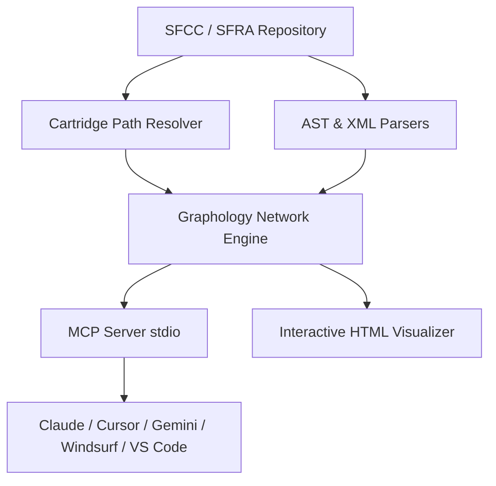

# graphify-sfcc 🚀

[](https://www.npmjs.com/package/graphify-sfcc)
[](LICENSE)
[](https://nodejs.org)
[](#benchmark--accuracy)
[](https://sonarcloud.io/summary/overall?id=nabhat_graphify-sfcc)

> 💡 **Quick Setup Guide:** For step-by-step setup instructions across **Claude Code, Claude Desktop, Cursor, Gemini, Windsurf, and VS Code**, see the dedicated **[INSTALLATION.md](INSTALLATION.md)** guide.

---

An ultra-fast, Demandware-aware **code-graph engine and Model Context Protocol (MCP) server** for Salesforce Commerce Cloud (SFCC / SFRA) codebases.

`graphify-sfcc` lets AI coding assistants answer **"how is this wired?"** questions in **one deterministic tool call** (~200 tokens) instead of a slow, context-bloating chain of grep and file reads.

---

## ⚡ Why `graphify-sfcc`?

When an AI assistant investigates SFCC architecture — *which copy of `Checkout.js` wins on the cartridge path? where is this helper used? what does `HookMgr.callHook` dispatch to?* — raw text search fails:

1. **Context Bloat:** Traditional grep requires multiple `grep → read → grep` round-trips. Each `read` dumps whole source files into context, consuming thousands of tokens.
2. **Incorrect Precedence:** Raw text search cannot resolve **cartridge path precedence** (`app_custom` vs `app_storefront_base`). It cannot tell which of five `Checkout.js` files actually executes or resolve `~/cartridge/...` requires.

### 📊 Benchmark: `graphify-sfcc` vs. Raw Grep

Head-to-head benchmark on 10 real-world SFCC architecture queries (evaluated against ground truth):

| Metric | Traditional Grep | `graphify-sfcc` | Improvement |
| :--- | :---: | :---: | :---: |
| **Tool Calls / Query (Avg)** | ~6.6 calls | **~2.1 calls** | ⚡ **3× Faster** |
| **Tokens / Query** | 5,000+ tokens | **~200 tokens** | 💰 **95% Token Savings** |
| **Cartridge Precedence** | Guesses / Fails | **Exact (Leftmost-Wins)** | 🎯 **100% Accuracy** |
| **Symbol Call-Site Recall** | Incomplete | **1.00 (Exact File:Line)** | 🔍 **Complete Precision** |

---

## 🎯 What it Models

`graphify-sfcc` indexes your entire repository into a high-performance **Graphology network graph**, capturing:

- 🗂️ **Cartridge Path Resolution:** `require('*/cartridge/...')` leftmost-wins precedence, `app_storefront_base/...`, `base/...`, relative `./`, and `dw/*` platform externals.
- 🔄 **Overlay & SuperModule Chains:** `module.superModule` override chains and shadowed modules across cartridges.
- ⚡ **SFRA `server.*` Route Wiring:** `prepend`, `append`, `replace`, `get`, `post`, `use`, and `extend` middleware bindings.
- 🪝 **`hooks.json` Dispatch:** Dynamic `HookMgr.callHook()` and `hooksHelper()` execution linked to script handlers.
- 📄 **ISML & Controller Graph:** Controller `res.render('template')` calls, ISML `<isinclude template="...">`, and `URLUtils.url(...)` routes.
- 🛠️ **Forms & Metadata:** `server.forms.getForm('name')` mapped to `forms/**/*.xml` definitions and field IDs.
- ⚠️ **Site Preference Silent-Null Auditor:** `getCustomPreferenceValue('id')` reads joined against `customPreferences.js` and system metadata XML to catch unconfigured preference bugs.
- 🌐 **Platform Globals:** Ambient `session`, `request`, `customer`, `response`, `pdict`, `slotcontent`, and `dw.order.OrderMgr`.

---

## 🏗️ Architecture Pipeline



---

## 🚀 Quick Start

### 1. Installation

Install `graphify-sfcc` globally via npm:

```bash
npm install -g graphify-sfcc
```

Verify installation:

```bash
graphify-sfcc --version
# Output: 0.1.0
```

---

### 2. CLI Commands

| Command | Description |
| :--- | :--- |
| **`graphify-sfcc`** *(or `serve`)* | Start the stdio MCP server for AI assistants. |
| **`graphify-sfcc build`** | Build/refresh graph index and output node/edge stats. |
| **`graphify-sfcc visualize`** | Generate an interactive HTML graph visualization and open it in browser. |
| **`graphify-sfcc install`** | Install the Claude skill (`.claude/skills/sfcc-graph/SKILL.md`) into your workspace. |

---

### 3. AI Assistant Integration

Configure `graphify-sfcc` in your AI coding assistant. Standard `stdio` config block:

```json
{
  "mcpServers": {
    "graphify-sfcc": {
      "command": "graphify-sfcc",
      "args": ["serve"],
      "env": {
        "SFCC_GRAPH_ROOT": "/absolute/path/to/your/sfcc-storefront-repo"
      }
    }
  }
}
```

#### Client Configuration Locations:

- **Claude Code CLI:** Run `claude mcp add graphify-sfcc -- graphify-sfcc serve`
- **Claude Desktop:** `%APPDATA%\Claude\claude_desktop_config.json` (Win) or `~/Library/Application Support/Claude/claude_desktop_config.json` (macOS)
- **Cursor:** `.cursor/mcp.json`
- **Windsurf:** `~/.codeium/windsurf/mcp_config.json`
- **Gemini CLI / Antigravity:** `~/.gemini/config/mcp_config.json` or workspace `.mcp.json`

*(See **[INSTALLATION.md](INSTALLATION.md)** for detailed client setup guides).*

---

## 🛠️ MCP Tool Reference

`graphify-sfcc` exposes 18 deterministic MCP tools to your AI agent:

| Tool | Purpose |
| :--- | :--- |
| `build_index` | Build or refresh graph index for target repository. |
| `stats` | Return total counts for cartridges, modules, routes, templates, and symbols. |
| `resolve_module` | Resolve exact target file path given a require specifier and caller context. |
| `who_overrides` | List override chain (`module.superModule`) and lower-precedence shadows. |
| `dependencies_of` | List all outbound require modules and imported scripts for a file. |
| `callers_of` | Find all inbound caller modules that require a given file. |
| `defines_symbols` | List top-level functions defined in a module with line numbers. |
| `symbol_usages` | Find exact `file:line` call sites of a function across the codebase. |
| `route_info` | Inspect controller route handlers (`prepend`, `append`, `replace`, `get`, `post`). |
| `hook_handler` | Find script handlers bound to a `hooks.json` hook extension point. |
| `template_graph` | Inspect ISML template includes (`<isinclude>`) and outbound route links. |
| `pref_usage` | Inspect site preference reads (`getCustomPreferenceValue`) vs metadata declarations. |
| `uses_global` | Find dw ambient global accesses (`session`, `request`, `customer`, `pdict`) in a file. |
| `global_usages` | Find all files accessing a specific dw ambient global. |
| `unresolved` | Audit dead require links, missing ISML templates, and orphan site preferences. |
| `search_nodes` | Search graph nodes by substring, cartridge name, or node kind. |
| `explain` | Return full attributes, incoming edges, and outgoing edges for any node. |
| `shortest_path` | Compute shortest dependency path between two files or symbols in the graph. |

---

## 🎨 Interactive Graph Visualizer

Generate an interactive, standalone HTML network visualization of your codebase architecture:

```bash
graphify-sfcc visualize
```

This creates `.sfcc-graph-cache/visualize.html` and automatically opens it in your default web browser.

---

## 💻 Programmatic SDK Usage

You can also use `graphify-sfcc` as a Node.js library in custom tooling:

```typescript
import { Index, CartridgeResolver } from 'graphify-sfcc';

// Build or load graph index for repository
const index = Index.build({ root: '/path/to/sfcc-storefront' });

// Query exact function call sites
const usages = index.symbolUsages('Handle');
console.log(usages);

// Resolve cartridge path precedence
const resolver = new CartridgeResolver('/path/to/sfcc-storefront');
const resolved = resolver.resolveRequire('*/cartridge/scripts/checkout/checkoutHelpers', 'app_custom');
console.log(resolved);
```

---

## 🧪 Testing & Quality Assurance

`graphify-sfcc` maintains **85.2% unit test coverage** across 60 test suites:

```bash
npm run build      # Compile TypeScript (tsc)
npm test           # Run 60 unit tests with LCOV path mapping
npm run smoke      # Execute graph integration smoke test
```

---

## ⚙️ Environment Variables

- `SFCC_GRAPH_ROOT`: Target SFCC repository root path.
- `SFCC_GRAPH_CARTRIDGE_PATH`: Override cartridge resolution path (e.g. `app_custom:app_storefront_base`).
- `SFCC_GRAPH_CACHE`: Override disk cache folder (default `<repo-root>/.sfcc-graph-cache/`).

---

## 📄 License

Distributed under the [MIT License](LICENSE). Created by [nabhat](https://github.com/nabhat).
